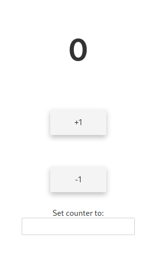

# Simple Counter

This is a simple SPA ([check it out](https://goofy-keller-7f29d3.netlify.app/)) using [Svelte](https://svelte.dev/) to create a simple counter that saves the last value in the browsers localStorage.

## What it looks like:
<div style="text-align:center">
  
</div>
So obviously it's nothing special, but it was still a nice intro into localStorage and how to use it. I also plan to add more little features to it.

## Get started with modifying

Install the dependencies...

```bash
cd annasCounterSite
npm install
```

...then start [Rollup](https://rollupjs.org):

```bash
npm run dev
```

Navigate to [localhost:5000](http://localhost:5000). You should see your app running. Edit a component file in `src`, save it, and reload the page to see your changes.
